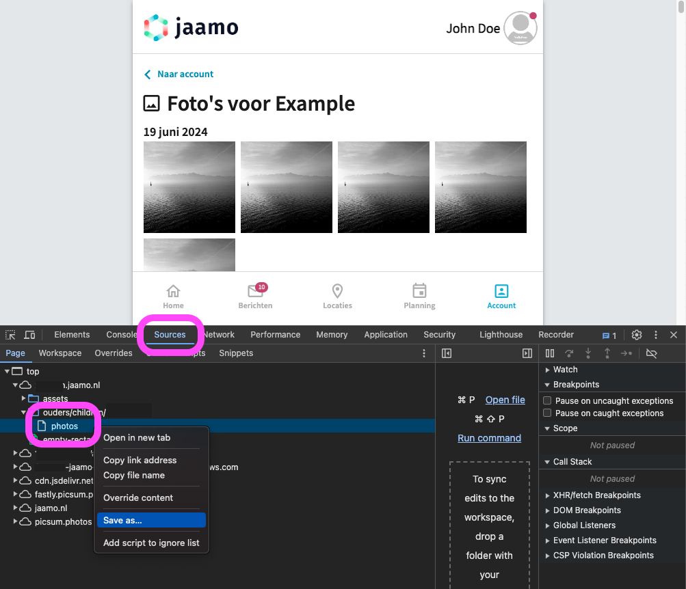

# Jaamo photo exporter

A script to download all photos from the Jaamo app at once.

The script will iterate through the app's gallery page html, to download every photo and store it, using it's date and description. Longer descriptions will be stored in a separate text file.

> **NOTE:**
> This tool, nor myself, are in any way related to Jaamo or Jaamo b.v.
> As a user of their parent-app, I am just working around the lack of this functionability in the official app and thus not having to go by 1800+ photo's one by one.
>
> - The script does not have access to your Jaamo account, so in no way can it access or affect any photo's or other data in your Jaamo account.
> - Since the script makes use of css selectors, it might not work as expected, as soon as Jaamo changes anything on their page. I will not be actively maintaining it.

### Run the script

The script can be run from cli.

1. Install elixir: https://elixir-lang.org/install.html
2. Save the html input as `photos.html` in the `input` folder: see [Input](#input)
3. Run the script: `elixir jaamo_photo_exporter.exs`
   If the input is located in another file, pass the path to it like this:
   `INPUT_FILE=input/example.html elixir jaamo_photo_exporter.exs`
4. Output can be found in the `output` folder

Give it a try: `INPUT_FILE=input/example.html elixir jaamo_photo_exporter.exs`

> **NOTE:**
> Jaamo source images are stored at AWS. The path to them, retrieved from the html page, contains an auth token which is only valid for 10 minutes.
> Therefore the script should be run immediately after refreshing and saving the html page.

### Input

Input is the plain html of the `Photo's` page in the webapp, found at `https://[organisation].jaamo.nl/ouders/children/[child_id]/photos`. Or by navigating to `Account` > `Profielen` > `Alle foto's`

1. Navigate to the page mentioned above
2. Open your browser's dev tools
3. Navigate to `Sources` tab
4. Save the entire page as a html file by right clicking `photos`

